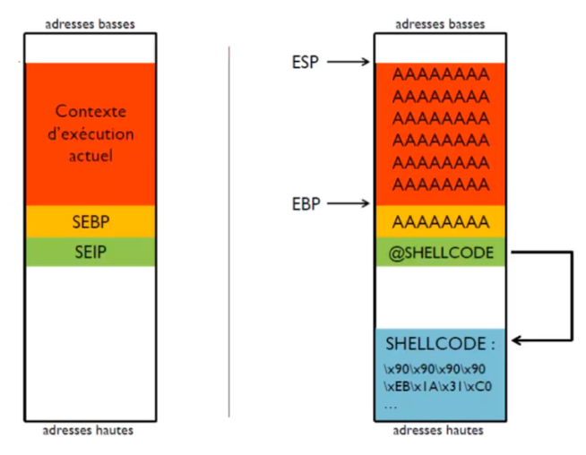

# buffer Overflow
## Application Vulnerability
In french  `dépassement de tampon ou débordement de tampon`

copy data without checking size.
A bug whereby a process, when writing to a buffer, writes outside the space allocated to the buffer, thus overwriting information necessary for the process.
<hr>

## Most common exploitation
1. stack overflow
2. Injection of a shellcode on the stack and calculation of its address
3. Overflow of a variable on the stack
4. Overwriting SEIP with the shellcode address


## A C program to demonstrate buffer overflow
```c
#include <stdio.h>
#include <string.h>
#include <stdlib.h>
 
int main(int argc, char *argv[])
{
 
       // Reserve 5 byte of buffer plus the terminating NULL.
       // should allocate 8 bytes = 2 double words,
       // To overflow, need more than 8 bytes...
       char buffer[5];  // If more than 8 characters input
                        // by user, there will be access 
                        // violation, segmentation fault
 
       // a prompt how to execute the program...
       if (argc < 2)
       {
              printf("strcpy() NOT executed....\n");
              printf("Syntax: %s <characters>\n", argv[0]);
              exit(0);
       }
 
       // copy the user input to mybuffer, without any
       // bound checking a secure version is strcpy_s()
       strcpy(buffer, argv[1]);
       printf("buffer content= %s\n", buffer);
 
       // you may want to try strcpy_s()
       printf("strcpy() executed...\n");
 
       return 0;
}
```
## Test
Open terminal
1. compile the program
```terminal
gcc -g -o BOF testoverflow.c
```
2. execute
```terminal
./BOF sam
```
3. output

```
buffer content= sam
strcpy() executed...
```

### now enter more than 8 characters.
```
./BOF beididinasamuel
```
output

```
buffer content= beididinasamuel
strcpy() executed...
Erreur de segmentation
```
### exploit, use GDB in terminal
```
$gdb -q ./BOF 
```
output
```
Reading symbols from ./BOF...
(gdb) 
```